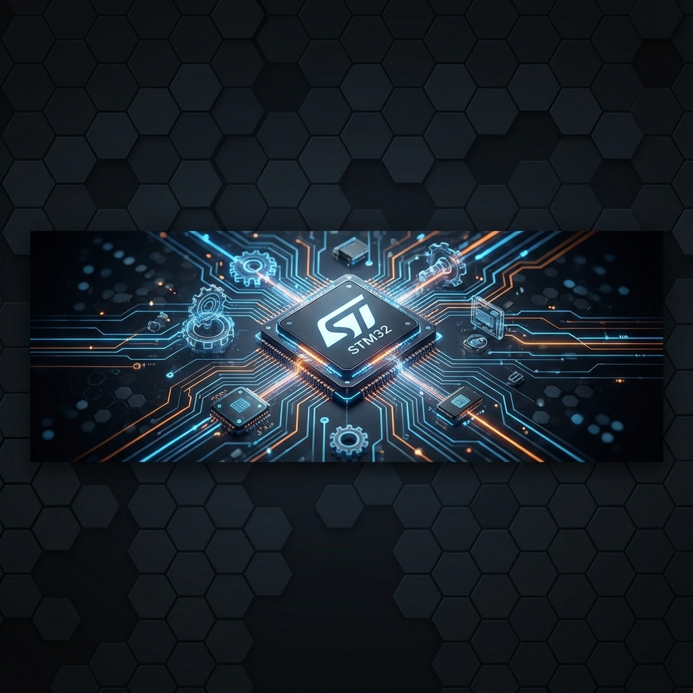
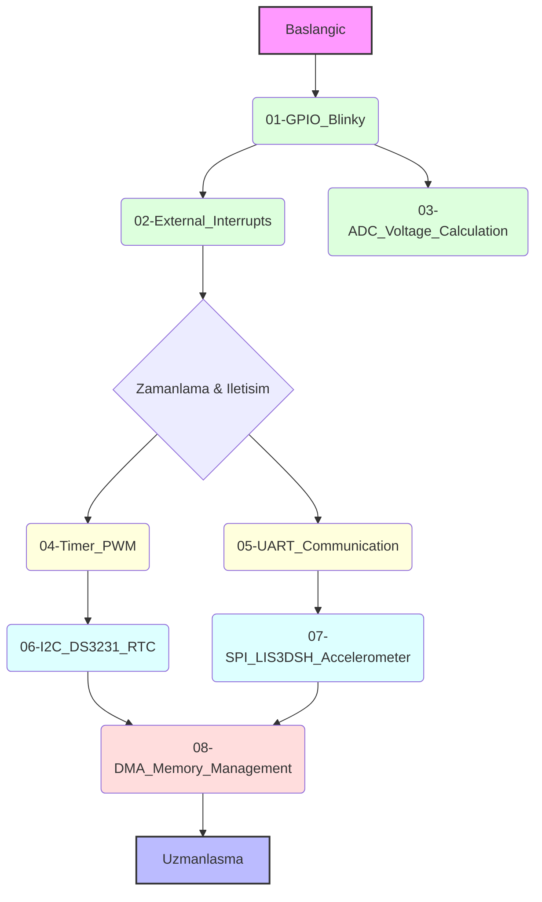

<div align="center">

# STM32 ile Gömülü Yazılım Geliştirme
### Profesyonel Gömülü Sistemler ve ARM Mimarisi Eğitimi

[](LICENSE)
[](https://www.st.com/en/microcontrollers-microprocessors/stm32f407vg.html)
[](https://en.wikipedia.org/wiki/C_(programming_language))
[]()

</div>

---

## 🎓 Eğitim Hakkında

Bu depo, **BTK Akademi** bünyesinde **Muhammed Fatih KÖSEOĞLU** tarafından verilen **STM32 ile Gömülü Yazılım Geliştirme** eğitiminin uygulama notlarını, kaynak kodlarını ve proje örneklerini içermektedir.

> **Eğitim Kodu:** 258  
> **Eğitmen:** Muhammed Fatih KÖSEOĞLU  
> **Eğitim Linki:** [BTK Akademi - STM32 ile Gömülü Yazılım Geliştirme](https://www.btkakademi.gov.tr/portal/course/stm32-ile-gomulu-yazilim-gelistirme-35649?t=DOC)

### 🎯 Eğitimin Amacı
Bu dersin amacı, gömülü yazılım mühendisliği hakkında bilgi edinmek, **ARM mimarili mikrodenetleyicileri** tanımak ve bu mikrodenetleyiciler üzerinde yazılım geliştirerek gömülü yazılım mühendisliği alanında bilgi ve beceri kazanımlarını sağlamaktır.

---

## � Neler Öğreneceksiniz?

Bu eğitim seti ile aşağıdaki konularda uzmanlaşacaksınız:

*   🏛️ **ARM Cortex-M4 Mimarisi:** İşlemci çekirdeği, hafıza haritası ve bus yapısı.
*   ⏱️ **Clock & RCC:** Sistem saati yapılandırması ve güç yönetimi.
*   🔌 **GPIO Yönetimi:** Dijital giriş/çıkış işlemleri ve harici kesmeler (EXTI).
*   📊 **Analog Sinyaller:** ADC birimi ile sensör okuma ve voltaj hesaplamaları.
*   ⏲️ **Zamanlayıcılar (Timers):** PWM üretimi, input capture ve zamanlama kesmeleri.
*   📡 **Haberleşme Protokolleri:** UART, I2C ve SPI ile modüler haberleşme.
*   ⚡ **DMA (Direct Memory Access):** İşlemciyi yormadan veri transferi.

## 🗺️ Öğrenme Yol Haritası (Roadmap)

Aşağıdaki diyagram, bu eğitim serisindeki konuların birbirleriyle olan ilişkisini ve önerilen öğrenme sırasını göstermektedir:



---

## 🛠 Donanım Gereksinimleri

Proje örneklerini uygulayabilmek için aşağıdaki donanımlara ihtiyacınız olacaktır:

| Donanım | Açıklama |
| :--- | :--- |
| **STM32F407G-DISC1** | Ana Geliştirme Kartı (Discovery Board) |
| **DS3231 RTC Modülü** | Hassas Gerçek Zamanlı Saat (I2C) |
| **USB-Mini Kablo** | Kartı programlamak için |
| **Jumper Kablolar** | Bağlantılar için (Erkek-Erkek, Dişi-Erkek) |

---

## � Proje Yapısı

Depo, kolay erişim için konulara göre ayrılmış klasörlerden oluşmaktadır:

```text
stm_learning/
├── 01-GPIO_Blinky/              # Temel LED yakıp söndürme
├── 02-External_Interrupts/      # Buton ile kesme kontrolü
├── 03-ADC_Voltage_Calculation/  # ADC ile sıcaklık ve voltaj okuma
├── 04-Timer_PWM/                # PWM sinyali ile LED parlaklık kontrolü
├── 05-UART_Communication/       # Bilgisayar ile seri haberleşme
├── 06-I2C_DS3231_RTC/           # I2C protokolü ile RTC modül kullanımı
├── 07-SPI_LIS3DSH_Accelerometer/# SPI ile dahili ivmeölçer okuma
└── 08-DMA_Memory_Management/    # DMA ile yüksek hızlı veri transferi
```

---

## 📚 Kaynaklar ve Dokümantasyon

Geliştirme sürecinde kullanılan resmi dokümanlar:

| Doküman | Açıklama | Bağlantı |
| :--- | :--- | :---: |
| **Reference Manual** | Donanım kayıtları (Registers) ve çevre birimleri detayları | [PDF İndir](https://www.st.com/resource/en/reference_manual/dm00031020-stm32f405-415-stm32f407-417-stm32f427-437-and-stm32f429-439-advanced-arm-based-32-bt-mcus-stmcroelectroncs.pdf) |
| **Datasheet** | Pin yapısı, elektriksel özellikler ve hafıza haritası | [PDF İndir](https://www.st.com/resource/en/datasheet/dm00037051.pdf) |
| **Schematic** | Kartın devre şeması ve bağlantı yolları | [PDF İndir](https://www.st.com/resource/en/schematc_pack/mb997-f407vgt6-b02_schematc.pdf) |

---

## 🤝 Katkıda Bulunma

Bu proje açık kaynaklıdır ve gelişime açıktır. Katkıda bulunmak isterseniz:

1.  Projeyi **Fork** edin.
2.  Yeni bir **Branch** oluşturun (`feature/yeni-ozellik`).
3.  Değişikliklerinizi **Commit** edin.
4.  Dalınızı **Push** edin.
5.  Bir **Pull Request** açın.

Detaylı rehber için [CONTRIBUTING.md](CONTRIBUTING.md) dosyasına göz atabilirsiniz.

---

<div align="center">

*Bu repo, gömülü sistemler tutkunları için hazırlanmıştır.*  
⭐ **Projeyi beğendiyseniz yıldız vermeyi unutmayın!**

</div>